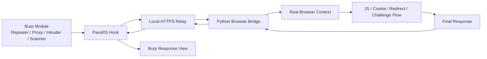

# PassRS
#兼容性问题与若干bug正在修复..请关注之后版本
PassRS is a Burp Suite extension that relays selected Burp requests into a real browser context, then returns the browser-side result back to Burp.

It is designed for targets where normal Burp replay is blocked by frontend anti-replay, anti-bot, challenge pages, dynamic cookies, or browser-context-dependent request flows.

## What It Does

PassRS sits between Burp and the target:

- Burp is still used for capture, editing, replay, and analysis
- PassRS intercepts selected requests and forwards them to a local relay
- The relay drives a real browser through Python + DrissionPage
- The browser executes the request in a real page/session context
- The final result is sent back to Burp as the response

This is useful when:

- the browser succeeds but Repeater returns `412`, `403`, or challenge pages
- the target relies on dynamic cookies, redirects, or JS-triggered follow-up requests
- the request must run in a real browser context instead of plain protocol replay

## Main Features

- Real-browser replay for selected Burp requests
- Request filtering by Burp module
- Scope filtering: all / in-scope / out-of-scope
- Target host or IP regex matching
- GET and POST handling with browser-context execution
- Challenge-page follow-up handling
- Optional static resource loading control
- Browser reuse to reduce repeated launches
- Auto-save configuration in the extension UI
- Local HTTPS relay for Burp-to-browser bridging

## Workflow



## Requirements

### Runtime

- Burp Suite with Montoya API support
- Java 21
- Python 3.11+ recommended
- Microsoft Edge or Google Chrome

### Python Dependencies

Install these in the Python environment that PassRS will use:

```bash
pip install DrissionPage lxml
```

On Windows, if multiple Python installations exist, configure the exact Python path in the PassRS settings panel.

## Supported Environment

PassRS currently includes handling for:

- Windows
- macOS

Browser path and Python path can be configured manually in the UI for more complex installations.

## Build

This project is a Maven multi-module build.

From the repository root:

```bash
mvn -pl extension -am package
```

The packaged extension jar is generated in:

```text
extension/target/PassRS-v<version>.jar
```

## Install in Burp

1. Build the extension jar.
2. Open `Burp Suite -> Extensions`.
3. Add the generated jar as a Java extension.
4. Open the `PassRS` tab in Burp.
5. Configure:
   - enable/disable hook
   - browser type
   - browser path
   - Python path
   - timeout
   - scope mode
   - Burp tool modules
   - target regex
   - static resource loading

## Configuration Overview

### Enable Relay Hook

Turns browser relay mode on or off.

### Scope

Controls whether PassRS works on:

- all requests
- in-scope only
- out-of-scope only

### Tools

Choose which Burp modules are allowed to trigger the relay.

### Target Regex

Restrict relay execution to specific target hosts or IPs using regex.

### Browser Path

Optional manual path to Edge or Chrome.

### Python Path

Optional manual path to the Python executable or Python installation directory.

### Static Resources

Allows or blocks image/media/font resource loading during browser rendering.

## Typical Use Cases

- Replay blocked requests that only succeed in a real browser
- Analyze challenge pages that trigger follow-up browser requests
- Test targets protected by frontend anti-replay logic
- Keep manual testing inside Burp instead of switching completely to browser automation tools

## Notes

- PassRS is not a universal bypass for every anti-bot or anti-replay product.
- Complex fingerprint-heavy targets may still require target-specific analysis.
- File-upload-heavy multipart scenarios may need further compatibility work.
- Browser-context replay is stateful; stability is prioritized over unrestricted parallel execution.

## Troubleshooting

### Python bridge fails to start

Check:

- Python path is correct
- `DrissionPage` is installed
- `lxml` is installed
- the selected Python can import both packages

Quick test:

```bash
python -c "import DrissionPage, lxml.etree; print('OK')"
```

### Browser launches repeatedly

Check:

- the configured browser path is correct
- the browser can be started normally
- the request is not failing before browser reuse can be established

### Burp still shows challenge or 412

Possible causes:

- the target requires additional browser-side follow-up steps
- the request type does not match the expected execution path
- the site depends on stronger browser fingerprinting than normal session replay

## Project Structure

```text
.
├─ burp-extensions-montoya-api/
├─ extension/
│  ├─ src/main/java/passrs/
│  └─ src/main/resources/
├─ docs/
└─ pom.xml
```

## License

Add a license before publishing publicly.
