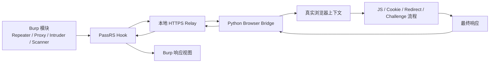

# PassRS

PassRS 是一个 Burp Suite 扩展，用于把选中的 Burp 请求转到真实浏览器上下文中执行，再把结果回传给 Burp。

它适合这类场景：

- Repeater 直接重放返回 `412`、`403` 或挑战页
- 目标依赖动态 Cookie、JS 跳转、二次请求或浏览器上下文
- 请求必须在真实浏览器环境里跑通，而不是单纯协议层重放

## 主要功能

- 基于真实浏览器执行选中的 Burp 请求
- 按 Burp 模块过滤请求
- 按作用范围过滤：全部 / 仅 In-scope / 仅 Out-of-scope
- 支持目标主机或 IP 的正则限制
- 支持 GET 和 POST 的浏览器上下文重放
- 支持挑战页、前端跳转、二次请求后的回传
- 可选加载静态资源
- 浏览器复用，减少重复启动
- 配置自动保存
- 内置本地 HTTPS relay

## 工作方式



## 环境要求

- Burp Suite，且支持 Montoya API
- Java 21
- Python 3.11+
- Microsoft Edge 或 Google Chrome

## Python 依赖

在 PassRS 使用的 Python 环境中安装：

```bash
pip install DrissionPage lxml
```

如果系统里有多个 Python，请在 PassRS 配置页里填写准确的 Python 路径。

## 构建

这是一个 Maven 多模块工程。

在仓库根目录执行：

```bash
.\mvnw.cmd -pl extension -am package
```

构建产物位于：

```text
extension/target/PassRS-v<version>.jar
```

## 在 Burp 中安装

1. 先构建插件 jar。
2. 打开 `Burp Suite -> Extensions`。
3. 以 Java 扩展方式加载生成的 jar。
4. 打开 Burp 中的 `PassRS` 标签页。
5. 按需配置：
   - 是否启用 Hook
   - 浏览器类型
   - 浏览器路径
   - Python 路径
   - 超时时间
   - 作用范围
   - 触发的 Burp 模块
   - 目标正则
   - 是否加载静态资源

## 配置说明

### Enable Relay Hook

控制是否启用浏览器转发模式。

### Scope

控制插件作用于：

- 所有请求
- 仅 In-scope 请求
- 仅 Out-of-scope 请求

### Tools

选择哪些 Burp 模块可以触发 PassRS。

### Target Regex

通过正则限制只对特定主机或 IP 生效。

### Browser Path

可手动指定 Edge 或 Chrome 路径。

### Python Path

可手动指定 Python 可执行文件或 Python 安装目录。

### Static Resources

控制浏览器渲染时是否允许加载图片、字体、媒体等静态资源。

## 常见用途

- 重放只能在真实浏览器里成功的请求
- 处理挑战页和浏览器后续流程
- 测试前端防重放逻辑
- 保持手工测试在 Burp 内完成，而不是切到外部自动化工具

## 注意事项

- PassRS 不是通用绕过器。
- 强指纹、强风控站点仍可能需要站点级分析。
- 大文件上传和复杂 multipart 场景可能还要继续兼容。
- 浏览器上下文执行是有状态的，不适合强并发。
