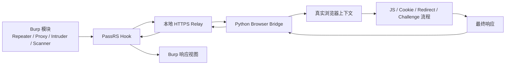

# PassRS

PassRS 是一个 Burp Suite 插件，用来把指定的 Burp 请求转发到真实浏览器上下文中执行，再把浏览器侧的结果回传给 Burp。

它主要面向这类场景：

- Burp Repeater 直接重放返回 `412`、`403` 或前端挑战页
- 目标站点依赖前端动态 Cookie、JS 跳转、二次请求、挑战页重放
- 请求必须在真实浏览器环境里才能跑通，而不是单纯的协议层重放

## 作者信息

- 作者：`Zmz-c`
- GitHub：`https://github.com/Zmz-c/PassRS`

## 功能简介

PassRS 的工作方式可以概括为：

- Burp 继续负责抓包、改包、重放、查看响应
- PassRS 拦截选中的 Burp 模块请求
- 请求会被改写到本地 HTTPS relay
- relay 调用 Python + DrissionPage 驱动真实浏览器
- 浏览器在真实页面、真实 Cookie、真实 JS 环境中执行请求
- 最终结果再返回给 Burp

## 主要特性

- 基于真实浏览器上下文执行请求
- 支持按 Burp 模块选择是否启用
- 支持按作用范围选择：全部 / 仅 In-scope / 仅 Out-of-scope
- 支持按目标域名或 IP 的正则进行限制
- 支持 GET、POST 请求的浏览器侧重放
- 支持空 body 的 POST
- 支持标准 `application/x-www-form-urlencoded`
- 支持非标准 `application/x-www-form-urlencoded` 原始 body
- 支持可安全重建的 `multipart/form-data`
- 支持 JSON、文本等原始 body 导航型 POST
- 支持挑战页、前端二次跳转、隐藏表单等浏览器后续流程
- 支持可选加载静态资源
- 支持浏览器复用，减少重复启动
- 支持配置页自动保存
- 内置本地 HTTPS relay

## 典型用途

- 重放只能在浏览器里成功、在 Repeater 里失败的请求
- 处理某些前端防重放、防自动化、防脚本挑战页
- 在 Burp 内继续完成测试，而不是来回切换到外部自动化脚本
- 对依赖真实 Cookie、真实 JS、真实页面状态的请求做验证

## 工作流程



## 环境要求

### 运行环境

- Burp Suite，且支持 Montoya API
- Java 21
- Python 3.11 及以上
- Microsoft Edge 或 Google Chrome

### Python 依赖

在 PassRS 使用的 Python 环境中安装：

```bash
pip install DrissionPage lxml
```

如果系统中存在多个 Python，请在 PassRS 配置页中指定准确的 Python 路径。

## 当前兼容的请求类型

PassRS 对不同请求会按更保守的方式选择浏览器执行路径，尽量避免把请求错误改写成别的格式。

已覆盖的常见情况：

- 普通 GET
- 导航型 GET
- 空 body 的 POST
- 标准表单 POST
- 非标准 `application/x-www-form-urlencoded` 原始 body POST
- `multipart/form-data` 表单字段型 POST
- JSON、纯文本及其他原始 body 导航型 POST

## 构建方法

项目是一个 Maven 多模块工程。

在仓库根目录执行：

```bash
mvn -pl extension -am package
```

构建完成后，插件 Jar 一般位于：

```text
extension/target/PassRS-v<version>.jar
```

## Burp 中安装

1. 先构建插件 Jar。
2. 打开 `Burp Suite -> Extensions`。
3. 以 Java 扩展方式加载生成的 Jar。
4. 打开 Burp 中的 `PassRS` 标签页。
5. 根据需要配置：
   - 是否启用 Hook
   - 浏览器类型
   - 浏览器路径
   - Python 路径
   - 超时时间
   - 作用范围
   - 生效模块
   - 目标正则
   - 是否加载静态资源

## 配置说明

### Enable Relay Hook

控制是否启用 PassRS 的浏览器转发模式。

### Scope

控制插件作用于：

- 所有请求
- 仅 In-scope 请求
- 仅 Out-of-scope 请求

### Tools

选择哪些 Burp 模块可以触发 PassRS。

### Target Regex

通过正则限制只对特定域名或 IP 生效。

### Browser Path

可选。手动指定 Edge 或 Chrome 路径。

### Python Path

可选。手动指定 Python 可执行文件路径或安装目录。

### Static Resources

控制浏览器在渲染过程中是否允许加载图片、字体、媒体等静态资源。

## 使用建议

- 先只在 `Repeater` 上启用，确认目标站点兼容后，再逐步扩大到其他模块。
- 对强依赖前端状态的站点，建议先在浏览器中手工访问一次，再从 Burp 发起重放。
- 如果某类资源本身也是测试目标，不要一开始就全局禁用静态资源。
- 对有强挑战流程的站点，超时时间不要设得过低。

## 常见问题

### 1. Python bridge 启动失败

优先检查：

- Python 路径是否正确
- `DrissionPage` 是否已安装
- `lxml` 是否已安装
- 当前配置的 Python 是否能正常导入这两个包

快速验证：

```bash
python -c "import DrissionPage, lxml.etree; print('OK')"
```

### 2. 浏览器反复启动

优先检查：

- 浏览器路径是否正确
- 浏览器本体能否正常启动
- 当前请求是否在复用浏览器前就已经失败

### 3. Burp 里仍然看到 412 或挑战页

可能原因：

- 目标站点还依赖额外的浏览器后续动作
- 当前请求被归类到了不合适的执行路径
- 站点对浏览器指纹要求更高，不是普通会话重放就能通过

## 项目结构

```text
.
├── burp-extensions-montoya-api/
├── extension/
│   └── src/main/java/passrs/
├── src/
├── pom.xml
├── README.md
└── README.zh-CN.md
```

## 说明

- PassRS 不是对所有前端防护都通杀的通用绕过器。
- 某些强指纹、强设备校验、强风控站点，仍然需要针对性分析。
- 大文件上传、复杂 multipart、极端定制挑战链路，仍可能需要继续兼容。


