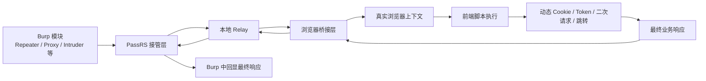

# 从“能够抓包”到“能够穿透前端防护”：PassRS 的设计思路、技术原理与实现方法

## 引言

在实战渗透测试中，我们经常会遇到一类以前端动态校验为核心的防护产品。此类机制通常会通过动态 Cookie、页面脚本执行、二次请求校验、上下文绑定等方式，对请求发起环境进行识别，从而实现防重放控制。

这意味着，即使测试人员已经在浏览器中正常访问目标系统，将同样的请求放入 Burp Repeater 中重放时，仍然可能得到 `412`、`403` 或挑战页，而无法获得真实业务响应。问题的根源并不只是请求参数本身，而在于传统重放机制难以完整复现真实浏览器中的前端执行链路。

在爬虫场景中，这类问题往往可以通过逆向前端逻辑来解决；但在渗透测试场景下，时间成本和目标复杂度往往不允许我们对每一套前端防护都进行深入逆向。测试工作既不能长期停留在单点绕过上，又必须解决前端防护对验证效率带来的实际阻碍。

基于这一现实需求，一个更具工程价值的思路便出现了：

> 既然问题在于 Burp 本身不具备完整的浏览器执行能力，那么，是否可以让 Burp 与真实浏览器协同工作，由浏览器负责执行请求，再将最终结果返回给 Burp？

PassRS 正是在这一思路下形成的一种工程化尝试。

## 问题背景：传统重放机制为何越来越受限

在过去较长一段时间内，Web 安全测试的核心工作更多聚焦于服务端。测试人员只要能够抓到原始请求、修改参数并完成重放，就足以覆盖大量验证场景。

但今天的应用环境已经发生了明显变化。前端不再只是展示层，而越来越多地承担了状态建立、令牌分发、挑战验证、参数签名、行为校验等职责。许多防护产品的关注重点，也不再只是“请求内容是否异常”，而是“请求是否由真实浏览器在真实上下文中发起”。

典型表现包括：

- 首次请求返回挑战页，页面脚本在浏览器中自动生成 Cookie 或令牌
- 页面访问成功后，真实业务请求并非首包，而是由 `fetch/XHR` 二次发起
- 同一个 URL 在浏览器中可访问，在 Burp 中却持续返回拦截响应
- 请求成功依赖浏览器上下文中的 DOM、历史记录、存储状态或自动跳转链路
- 部分目标对 TLS、HTTP/2、浏览器会话特征具有明显依赖

在这种情况下，传统的“协议层抓包 + 协议层重放”并没有失去价值，但它的适用边界显著收缩。  
测试人员真正需要的，已经不只是“让请求看起来像浏览器发出的”，而是“让请求尽量在真实浏览器环境中完成执行”。

## PassRS 的核心定位

PassRS 是一个面向 Burp Suite 的浏览器桥接式重放插件。  
它的目标不是替代 Burp，也不是单独构建一套浏览器自动化框架，而是在 Burp 既有工作流中补上一层长期缺失的能力：**真实浏览器执行层**。

其核心逻辑可以概括为一句话：

> 在 Burp 中发起重放，在真实浏览器中执行请求，再将浏览器拿到的最终结果同步返回 Burp。

这意味着：

- Burp 仍然负责抓包、查看、修改、筛选与重放
- 浏览器负责执行前端脚本、建立上下文、处理挑战链路
- 插件负责在 Burp 与浏览器之间完成请求桥接、结果回传与流程协调

因此，PassRS 并不是简单地“把 Burp 的请求转发给浏览器”，而是在测试工作流中构建了一条完整的桥接链路，使 Burp 具备调用真实浏览器执行请求的能力。

## 一张图看懂 PassRS 的工作方式

如果从使用者视角来看，测试入口仍然在 Burp；  
但从执行路径来看，请求已经不再完全由 Burp 自身发出，而是由真实浏览器代表 Burp 完成执行。

## 技术原理：PassRS 解决问题的底层思路是什么

PassRS 的技术原理，并不复杂到必须依赖大量特定站点逻辑，它本质上建立在一个非常直接的判断上：

> 当前很多前端防护拦截的并不是“请求包本身”，而是“请求发起环境”。

因此，若想提高对这类目标的适配能力，就不能只停留在协议层，而必须把执行环境一并纳入重放过程。

围绕这一点，PassRS 的整体技术原理可以拆分为四个层面。

### 1. 请求不再直接由 Burp 发往目标，而是先进入本地桥接链路

传统 Burp Repeater 的逻辑是直接向目标服务端发包；  
而 PassRS 在命中规则后，会优先接管请求，使其先进入本地 Relay，再由后续桥接层进行处理。

这样做的目的，是把原始请求与后续浏览器执行解耦。  
Burp 负责发起和控制，PassRS 负责接管与转译，浏览器负责实际执行。

### 2. 请求在浏览器上下文中重新执行，而不是只做文本级重放

浏览器的价值，不只是“带一个 User-Agent”，而是它具备完整的执行环境，包括：

- DOM
- Cookie 与本地存储
- 页面脚本执行能力
- 页面跳转与表单提交流程
- 同源上下文与前端状态链路

当请求被放回真实浏览器环境中执行时，前端防护依赖的很多前置条件会被自然满足，而不必由测试人员逐一逆向和手工模拟。

### 3. 对页面型请求与接口型请求采用不同执行策略

浏览器中的请求并不是单一模型。  
页面导航、表单提交、脚本发起的接口请求，三者在浏览器中的执行路径完全不同。如果一概以同一种方式重放，就很容易出现“看似发出请求，实际上下文不匹配”的问题。

因此，PassRS 的技术思路并不是机械地“把所有请求都交给浏览器”，而是根据请求特征区分其执行方式，例如：

- 页面型请求更适合走真实导航链路
- 表单型请求更适合走真实提交流程
- 接口型请求更适合在浏览器上下文中以 `fetch/XHR` 形式执行

这种分流，本质上是在尽量贴近浏览器原生行为，而不是将所有请求粗暴统一处理。

### 4. 最终返回给 Burp 的不是第一跳响应，而是浏览器完成链路后的结果

很多前端防护的关键点就在于：第一跳响应并不是最终业务结果，而只是一个中间挑战状态。  
如果插件仍然把第一跳响应回传给 Burp，那么从测试效果看，与传统 Repeater 没有本质区别。

因此，PassRS 的真正关键，不是“把请求送进浏览器”，而是“把浏览器执行后的最终结果再带回 Burp”。  
只有做到这一点，Burp 中看到的响应才真正具备分析价值。

## 实现方法：PassRS 是如何落地这一思路的

在实现层面，PassRS 并不依赖某一种厂商专属规则，而是围绕“请求接管、浏览器执行、结果回传”这三个核心阶段展开。

### 第一阶段：在 Burp 中选择性接管请求

并非所有请求都需要进入浏览器桥接流程。  
PassRS 会根据配置的作用范围、目标规则和 Burp 模块，对请求进行筛选，仅对符合条件的请求进行接管。

这样做有两个现实意义：

- 避免对全部流量一刀切，影响正常测试效率
- 允许测试人员只在高价值目标或复杂前端站点上启用浏览器桥接

### 第二阶段：通过本地 Relay 承接原始请求信息

请求一旦被接管，就不再由 Burp 直接发往目标，而是先进入本地中继层。  
中继层承担的是“桥接节点”角色，其职责不是执行业务逻辑，而是将请求方法、目标地址、请求头和请求体整理后转交给浏览器执行层。

这一层的意义，在于把 Burp 侧的通信逻辑与浏览器侧的执行逻辑隔离开来，便于稳定管理执行流程、错误处理和结果回传。

### 第三阶段：在真实浏览器中重建执行上下文

浏览器执行层的任务，不是简单打开一个页面，而是尽量在合适的上下文中执行请求。  
这包括但不限于：

- 复用已有浏览器实例，降低重复启动成本
- 进入合适的页面上下文，避免跨域或状态错位
- 同步请求相关 Cookie，保证浏览器具备必要会话信息
- 根据请求类型选择导航、表单提交或脚本请求路径

从工程角度看，这一步的本质是“上下文恢复”，而不是“动作模拟”。

### 第四阶段：处理挑战页、中间页与自动二次请求

很多前端防护并不会在第一跳直接给出业务结果，而是会通过页面脚本或中间页继续推进流程。  
因此，浏览器执行层除了发起请求，还需要继续观察页面行为，例如：

- 页面是否进入挑战状态
- 是否自动写入新的 Cookie
- 是否触发脚本请求
- 是否出现中间表单自动提交
- 是否发生跳转并最终落在真实业务页面

这一阶段决定了插件是否能够真正拿到“浏览器视角下的最终结果”。

### 第五阶段：将最终结果结构化回传给 Burp

在浏览器侧拿到最终结果后，PassRS 需要再将其转换为 Burp 可识别、可分析、可重放的响应形式回传。  
这一步并不只是返回响应体本身，还包括：

- 最终状态码
- 最终页面地址
- 页面标题或上下文信息
- 最终响应内容

只有做到结构化回传，Burp 侧的分析、比对与后续手工测试才具备连续性。

## 为什么采用“浏览器桥接”而不是“规则绕过”

从结果上看，测试人员可能更关心“能不能拿到最终响应”；  
但从方法上看，PassRS 选择的其实是一条与传统绕过路线明显不同的道路。

传统方法往往强调：

- 如何补齐缺失请求头
- 如何伪造浏览器字段
- 如何逆向前端算法
- 如何复制挑战页中的参数生成逻辑

这些方法并非没有价值，但它们往往具有明显的局限性：

- 站点差异大，难以通用
- 维护成本高
- 新版本防护上线后容易失效
- 对渗透测试周期不够友好

相比之下，PassRS 所采用的路线是：

> 不优先伪造浏览器，而是优先借助真实浏览器。

这条路径的优势在于：

- 更接近真实用户访问链路
- 对新的前端校验机制具备更强适应性
- 减少对单站点逆向逻辑的依赖
- 更适合复杂页面和动态交互场景

## 当前设计中的几个关键特性

### 1. 支持页面型请求与接口型请求分流

不同请求类型采用不同执行策略，以贴近浏览器真实行为。  
当前覆盖的典型类型包括：

- `GET` 页面请求
- `GET` 接口请求
- 无请求体的 `POST`
- `application/x-www-form-urlencoded`
- `application/json`
- `multipart/form-data`
- 其它文本类请求体

### 2. 支持挑战页后续链路处理

对于首次返回 `412`、`403` 或挑战页的场景，PassRS 不会简单停留在第一跳，而是继续观察并处理：

- 脚本触发的二次请求
- 自动表单提交
- 中间页跳转
- 最终业务页面回传

### 3. 支持作用范围与 Burp 模块选择

PassRS 不是全局粗放式接管，而是支持根据作用范围和模块进行精确控制。  
这样既能提高针对性，也有助于控制整体性能开销。

### 4. 支持目标域名或 IP 正则匹配

对于多目标、多环境测试场景，可以只对指定域名或 IP 范围启用浏览器桥接，降低误接管概率。

### 5. 支持静态资源加载控制

在部分场景下，加载全部静态资源有助于还原页面真实状态；  
而在另一些场景下，适度屏蔽图片、媒体和字体资源，则有利于提升执行效率。  
PassRS 将这一能力做成可选配置，以兼顾兼容性与性能。

### 6. 针对并发场景做串行保护

真实浏览器上下文本身是强状态化环境。  
若多个重放请求同时争用同一浏览器上下文，极易出现页面抢占、状态污染和响应错位。  
因此，在当前阶段，PassRS 对浏览器桥接执行采用了更偏稳定性的控制策略，以避免多请求并发争用同一执行现场。

## 适用场景

PassRS 更适合以下类型的测试场景：

- 浏览器访问正常，但 Burp Repeater 长期返回 `412/403`
- 目标系统存在明显的前端挑战、动态 Cookie 或二次请求机制
- 业务接口依赖浏览器真实上下文
- 需要在 Burp 中持续完成手工验证，而不是跳转到纯浏览器自动化框架
- 需要在有限测试周期内提升复杂站点的验证效率

## 当前边界与后续空间

需要明确的是，PassRS 并不是一个“任何前端防护都能无成本解决”的通用终极方案。  
它能够显著提升对某类场景的兼容能力，但仍然存在边界，例如：

- 极端依赖浏览器指纹或环境特征的站点
- 带文件上传的复杂 `multipart` 场景
- 少量非标准 `GET + body` 请求
- 不同系统与 Python 运行环境下的依赖差异

但即便如此，这条路线本身是成立的，而且具有明确的实战意义。  
它代表的不是“再做一个重放工具”，而是对 Web 安全测试执行方式的一次补强。

## 结语

过去，Web 安全测试更关注服务端如何理解一个请求；  
而今天，越来越多的场景开始要求测试人员回答另一个问题：

> 这个请求，究竟是不是由一个真实浏览器，在真实上下文中发出的？

PassRS 的价值，就在于它试图将这一问题重新纳入 Burp 的主战场。

它未必是终点，但它代表了一条值得持续投入的方向：  
让安全测试工具不仅能够抓包和改包，也能够借助真实浏览器完成请求执行。

对于那些长期遭遇“浏览器能够访问、Burp 不能有效重放”困境的测试人员而言，这种思路并不是锦上添花，而是正在变得越来越必要。
